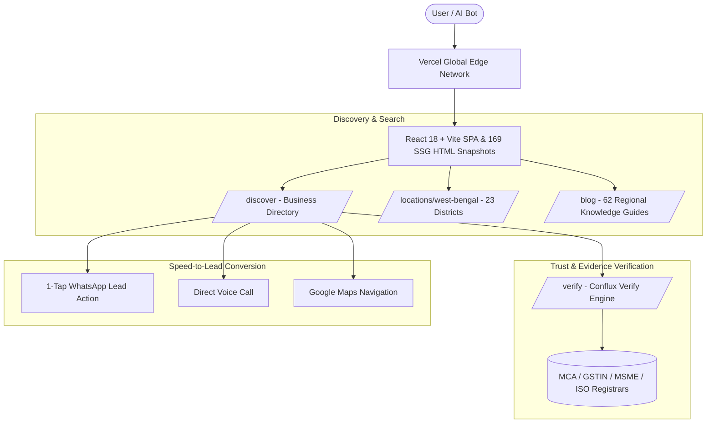

# 🌐 Conflux AI — Local Visibility + Trust Platform

[](https://confluxai.in)
[](https://www.typescriptlang.org/)
[](https://react.dev/)
[](https://vitejs.dev/)
[](https://tailwindcss.com/)
[](https://supabase.com/)
[](LICENSE)

> **Live Website:** [https://confluxai.in](https://confluxai.in)  
> **Mission:** Make local businesses discoverable, understandable, trusted, and contactable across Google Search, Google Maps, and AI/LLM search systems (Gemini, ChatGPT, Perplexity, Claude).

---

## 📌 Core Positioning

* **Canonical Description:** *"Conflux AI is a Local Visibility + Trust Platform that helps local businesses become discoverable, trusted, and contactable across Google and AI search."*
* **Consumer Proposition:** *"Find a business. Check the evidence. Decide with confidence."*
* **Business Proposition:** *"Get discovered. Build trust. Get contacted."*

---

## 🚀 Key Platform Features & Architecture



1. **Local Business Directory & Search (`/discover`, `/business/:slug`):** Filter by category, location, and statutory credentials with real-time Evidence Scores.
2. **Conflux Verify — Bounded Evidence Engine (`/verify`):** Deterministic claim normalizer and multi-tier evidence evaluator backed by primary registrars (MCA, GSTIN, MSME Udyam, IAF ISO).
3. **Geo & Local Knowledge Graph (`/locations/west-bengal`):** Structured coverage across all 23 districts of West Bengal with localized FAQs and verified nodes.
4. **Autonomous SSG & SEO Engine:** Automated Node.js pipeline generating 169 pre-rendered static HTML snapshots with Schema.org JSON-LD (`Organization`, `WebSite`, `LocalBusiness`, `Article`) and a 158-URL XML sitemap.
5. **Google Analytics 4 (GA4):** Global `G-4T4BL0LKQ5` integration with dynamic SPA navigation tracking (`lib/analytics.ts`).
6. **Remote-First Workplace Standards (`/workplace-policy`):** Transparent operating expectations around ownership, asynchronous communication, accountability, and ethics.

---

## 📂 Directory Layout

```text
Conflux-AI/
├── api/                  # Serverless edge endpoints (contact, verify, graph)
├── components/           # React component library
│   ├── admin/            # RBAC moderation dashboards
│   ├── auth/             # Authentication modals & protected route wrappers
│   ├── business/         # Business public profiles & visibility audit
│   ├── discover/         # Business search and discovery
│   ├── locations/        # 23 district hubs and city directories
│   ├── submission/       # Public business listing form
│   └── verify/           # Conflux Verify portal & methodology
├── data/                 # Static data models, district hubs, company JSON
├── dist/                 # Production build assets & 169 pre-rendered HTML files
├── docs/                 # Full developer documentation & architecture guides
│   ├── ARCHITECTURE_AND_DEVELOPER_GUIDE.md
│   └── verify/golden_test_set.json
├── lib/                  # Business logic, Supabase client, GA4, verification engine
├── public/               # Static assets, sitemap.xml, robots.txt, articles.json
├── scripts/              # Build, sitemap generator, prerenderer, test suites
├── types/                # TypeScript interface definitions
├── App.tsx               # Master router, dynamic SEO & canonical URL manager
├── LandingPage.tsx       # Homepage layout
├── index.html            # Entry HTML, Google Analytics, JSON-LD schemas
└── package.json          # Project scripts and dependencies
```

---

## 🛠️ Quickstart & Local Development

### Prerequisites
* **Node.js:** `v20.x` or higher
* **npm:** `v10.x` or higher
* **Git**

### Installation
```bash
# 1. Clone the repository
git clone https://github.com/Tarunjit45/Conflux-AI.git
cd Conflux-AI

# 2. Install dependencies
npm install

# 3. Configure environment variables
cp .env.example .env

# 4. Start local development server
npm run dev
```

Visit `http://localhost:5173` in your browser.

---

## 🧪 Testing & Verification Scripts

The codebase is protected by automated guardrail suites:

```bash
# Type check with strict TypeScript compiler
npx tsc --noEmit

# Run 129-point automated SEO, Canonical & SSR guardrail tests
npm run test:seo

# Run 23-point Conflux Verify boundary & evidence tests
npm run test:verify

# Run business directory graph integrity tests
npm run test:phase1

# Run business submission pipeline tests
npm run test:submission

# Run system hardening & performance test suite
npm run test:hardening
```

---

## 📦 Build & Deployment

To generate the production bundle along with the automated XML sitemap and 169 pre-rendered static HTML snapshots:

```bash
npm run build
```

This executes:
1. `vite build` $\to$ Compiles and minifies assets into `dist/assets/`.
2. `node scripts/generate_sitemaps.js` $\to$ Generates `public/sitemap.xml` with 158 verified URLs.
3. `node scripts/prerender_articles.js` $\to$ Pre-renders 169 static HTML snapshots with JSON-LD into `dist/`.

Continuous deployment is configured automatically via **Vercel** on push to `main`.

---

## 📚 Complete Developer Documentation

For an exhaustive guide covering every subsystem, registrar adapter, data schema, and step-by-step modification recipes, see:

👉 **[Master Architecture & Developer Guide (`docs/ARCHITECTURE_AND_DEVELOPER_GUIDE.md`)](docs/ARCHITECTURE_AND_DEVELOPER_GUIDE.md)**

---

## 👥 Leadership & Contact

* **Tarunjit Biswas** — Chief Executive Officer & CTO ([GitHub: @Tarunjit45](https://github.com/Tarunjit45))
* **Shouvik Majumdar** — Chief Financial Officer & CMO
* **Headquarters:** Kolkata, West Bengal 700001, India (Remote-First Platform)
* **General Inquiries:** `confluxai45@gmail.com`
* **Phone / WhatsApp:** `+91 97344 33100` / `+91 89725 17557`

---

## 📜 License

Distributed under the **MIT License**. See [`LICENSE`](LICENSE) for details.
