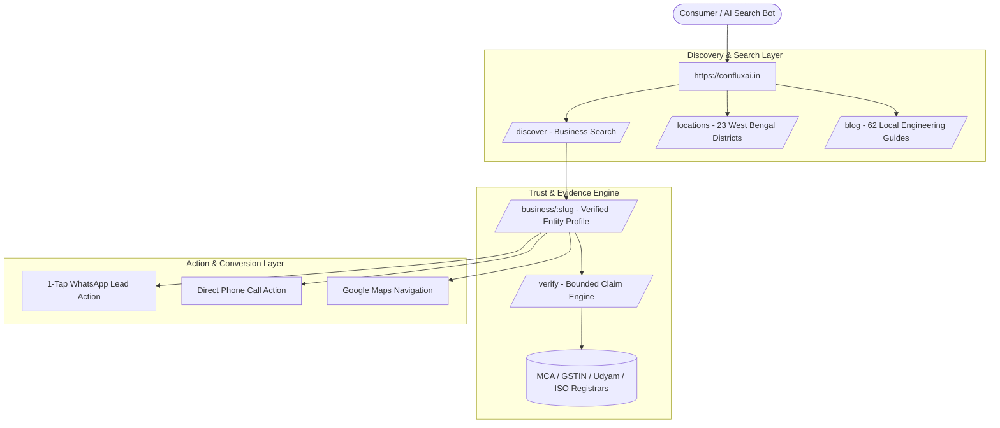
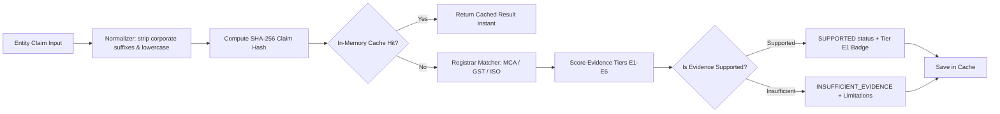
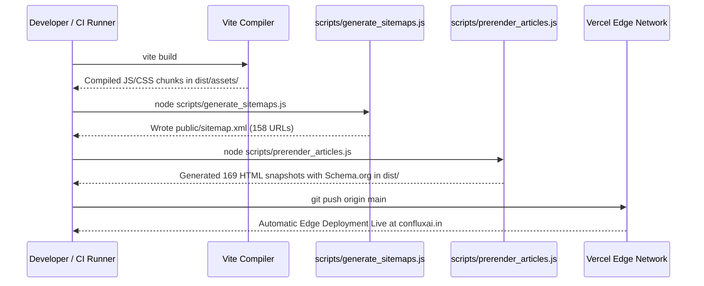

# 🏛️ Conflux AI — Master Architecture & Developer Guide

> **Platform:** [https://confluxai.in](https://confluxai.in)  
> **Repository:** [Tarunjit45/Conflux-AI](https://github.com/Tarunjit45/Conflux-AI)  
> **Founders:** Tarunjit Biswas (CEO & CTO) & Shouvik Majumdar (CFO & CMO)  
> **Headquarters:** Kolkata, West Bengal, India (Remote-First Operating Model)

---

## 1. 📌 Executive Summary & Platform Mission

**Conflux AI** is a **Local Visibility + Trust Platform**. Its core engineering mission is:

> *"Make local businesses discoverable, understandable, trusted, and contactable across Google Search, Google Maps, and AI/LLM search systems (Gemini, ChatGPT, Perplexity, Claude)."*

### Core Value Propositions:
* **For Consumers:** *"Find a business. Check the evidence. Decide with confidence."*
* **For Businesses:** *"Get discovered. Build trust. Get contacted."*

Rather than offering generic digital marketing or unverified claims, Conflux AI couples **structured entity graphs, Schema.org JSON-LD microdata, sub-second React architecture, and deterministic primary registrar verification (MCA, GSTIN, MSME Udyam, ISO)** with **1-tap WhatsApp speed-to-lead pipelines**.



---

## 2. 🛠️ Technology Stack & Dependencies

| Layer | Technology | Version | Purpose |
| :--- | :--- | :--- | :--- |
| **Core Framework** | React | `^18.3.1` | Component-based user interface and reactive state management |
| **Language** | TypeScript | `~5.6.2` | Static typing, interface contracts, and compilation safety |
| **Build & Bundler** | Vite / Rollup | `^5.4.10` | Ultra-fast HMR development server and optimized production chunking |
| **Styling** | Tailwind CSS | `^3.4.14` | Utility-first responsive design system with custom color variables |
| **Animation** | Framer Motion | `^11.11.17` | Smooth layout transitions, reveal animations, and micro-interactions |
| **Iconography** | Lucide React | `^0.454.0` | Crisp, tree-shakeable vector icons |
| **Routing** | React Router DOM | `^7.13.1` | Client-side routing with dynamic document title and canonical tag updates |
| **Database & Auth** | Supabase | `^2.99.2` | PostgreSQL database, row-level security (RLS), and authentication |
| **Analytics** | Google Analytics 4 | `G-4T4BL0LKQ5` | Global gtag.js tracking with SPA route-change listener (`lib/analytics.ts`) |
| **SSG / Prerendering** | Node.js (Custom) | ES Modules | Pre-renders 169 static HTML snapshots with Schema.org & OpenGraph in `dist/` |
| **Hosting & CDN** | Vercel Edge Network | Node 20.x | Global edge CDN, custom routing rewrites, and compression headers |

---

## 3. 📂 Codebase Directory Layout

```text
Conflux-AI/
├── api/                           # Serverless Edge API Functions
│   ├── contact.ts                 # Form lead submission handler
│   ├── verify.ts                  # Server-side verification proxy
│   └── graph/                     # Entity graph search & business query endpoints
├── components/                    # React Presentation & Container Components
│   ├── admin/                     # Admin Business Moderation & Coverage Dashboards
│   │   ├── AdminBusinessDashboard.tsx
│   │   └── LocationCoverageDashboard.tsx
│   ├── auth/                      # Authentication & Access Control
│   │   ├── AuthModal.tsx
│   │   ├── ProtectedRoute.tsx
│   │   └── UserOnboardingPrompt.tsx
│   ├── business/                  # Business Presentation Layer
│   │   ├── ForBusinessPage.tsx
│   │   ├── PublicBusinessProfile.tsx
│   │   └── VisibilityAuditPage.tsx
│   ├── discover/                  # Consumer Business Discovery
│   │   └── DiscoverPage.tsx
│   ├── locations/                 # District & Locality Hub Pages
│   │   ├── DistrictDirectoryPage.tsx
│   │   ├── LocationDetailPage.tsx
│   │   ├── LocationHubPage.tsx
│   │   └── IndustryLocationPage.tsx
│   ├── submission/                # Business Submission Flow
│   │   └── BusinessSubmissionPage.tsx
│   ├── verify/                    # Conflux Verify Evidence Portal
│   │   ├── VerifyPortal.tsx
│   │   ├── MethodologyPage.tsx
│   │   └── guides/VerifyGuideDetailPage.tsx
│   ├── AboutUsPage.tsx            # Canonical company profile & founders
│   ├── AdminCMS.tsx               # Content management interface
│   ├── ArticleDetail.tsx          # Zero-dependency blog reader
│   ├── AuthorityPage.tsx          # Authority signals & technical standards
│   ├── BlogPage.tsx               # Research feed & topic clusters
│   ├── BrandingControl.tsx        # Dynamic logo upload/reset
│   ├── Chatbot.tsx                # Embedded AI assistant
│   ├── CompanyGlance.tsx          # Quick facts & platform badges
│   ├── ContactPage.tsx            # Contact form & engineering leads
│   ├── CreativePage.tsx           # Media & creative suite
│   ├── FaqPage.tsx                # Enterprise & consumer FAQ
│   ├── Footer.tsx                 # Global footer & navigation columns
│   ├── Founders.tsx               # Founder profiles & credentials
│   ├── GEOPowerhouse.tsx          # GEO/AEO optimization signals
│   ├── Hero.tsx                   # Interactive hero banner
│   ├── ImpactPage.tsx             # Growth metrics & client outcomes
│   ├── Navbar.tsx                 # Global header navigation
│   ├── NotFoundPage.tsx           # 404 handler with fallback search
│   ├── PortfolioPage.tsx          # Case studies & visual showcase
│   ├── QuickServices.tsx          # Solutions grid
│   ├── RuralDigitalSolutionsPage.tsx # Regional solutions
│   ├── SemanticPage.tsx           # Knowledge graph visualizer
│   ├── ServiceDetailPage.tsx      # Deep dive service pages
│   ├── SolutionsPage.tsx          # Enterprise solutions catalog
│   ├── ThankYouPage.tsx           # Lead conversion & WhatsApp trigger
│   ├── VideoTrust.tsx             # Video verification showcase
│   └── WorkplacePolicyPage.tsx    # Remote-first workplace policy
├── data/                          # Static Data Models & Taxonomies
│   ├── articlesData.ts            # Topic taxonomy & cluster mappings
│   ├── company.json               # Single source of truth for company metadata
│   ├── locationsData.ts           # 23 West Bengal districts, hubs & cities
│   ├── servicesData.ts            # Platform solution definitions
│   └── topicsData.ts              # Semantic categorization
├── docs/                          # Architecture blueprints, audits & guides
│   ├── ARCHITECTURE_AND_DEVELOPER_GUIDE.md # (This file)
│   ├── CONFLUX_AI_ARCHITECTURE_BLUEPRINT.md
│   ├── CONFLUX_AI_AUDIT.md
│   └── verify/golden_test_set.json # 50 gold-standard real-world verification claims
├── lib/                           # Core Business Logic & Infrastructure
│   ├── analytics.ts               # Google Analytics 4 tracking helpers
│   ├── authContext.tsx            # Supabase Auth provider & RBAC
│   ├── businessService.ts         # Business directory CRUD & mock fallbacks
│   ├── leadService.ts             # Lead ingestion & notification routing
│   ├── supabase.ts                # Supabase client instantiation
│   └── verify/                    # Bounded Claim Verification Engine
│       ├── cache.ts               # In-memory deterministic claim cache
│       ├── normalizer.ts          # Normalizers for entity names & claim texts
│       ├── verificationService.ts # Multi-tier evidence evaluator
│       └── registrars/            # MCA, GSTIN, Udyam, ISO lookup adapters
├── public/                        # Static Assets & Public Data
│   ├── data/articles.json         # 62 verified, pre-computed blog articles
│   ├── robots.txt                 # Search bot crawling rules
│   ├── sitemap.xml                # Automated 158-URL XML sitemap
│   └── favicon.ico, images, etc.
├── scripts/                       # Node.js Build, Prerender & Test Automation
│   ├── generate_sitemaps.js       # Dynamic XML sitemap generator
│   ├── prerender_articles.js      # Static Site Generator (SSG for 169 pages)
│   ├── run_reality_benchmark.js   # Production reality verification runner
│   ├── smoke_test_live.js         # Live URL smoke testing
│   ├── test_business_submission.js# Business submission pipeline tests
│   ├── test_phase1_business_graph.js # Directory graph integrity tests
│   ├── test_phase3_hardening.js   # Security & performance tests
│   ├── test_seo_guardrails.js     # 129-point SEO & SSR assertion test suite
│   └── test_verify_boundaries.js  # 23-point verification engine test suite
├── types/                         # TypeScript Interface Definitions
│   ├── article.ts
│   ├── business.ts
│   ├── entity.ts
│   ├── evidence.ts
│   ├── location.ts
│   └── verify.ts
├── App.tsx                        # Master Router, ScrollToTop, Dynamic SEO & Canonical manager
├── LandingPage.tsx                # Homepage presentation coordinator
├── index.html                     # Root HTML template, JSON-LD Schemas, GA4 script
├── index.css                      # Tailwind imports and custom typography styles
├── package.json                   # Dependencies and npm scripts
├── tsconfig.json                  # TypeScript compiler settings
├── vercel.json                    # Vercel deployment routes and headers
└── vite.config.ts                 # Vite build & chunk configuration
```

---

## 4. 🧩 Core Subsystem Architecture

### 4.1. The Local Business Discovery Subsystem
* **Routes:** `/discover`, `/business/:slug`, `/business/india/west-bengal/:district/:city/:slug`
* **Components:** `components/discover/DiscoverPage.tsx`, `components/business/PublicBusinessProfile.tsx`
* **Data Layer:** `lib/businessService.ts`, `types/business.ts`
* **Mechanics:**
  1. Users filter businesses by category (e.g. Diagnostic Centers, Manufacturing, Textile Weavers, Hospitality) and location (Kolkata, Nadia, Hooghly, etc.).
  2. Each business profile displays structured **Name, Address, Phone (NAP)**, GPS coordinates, operating hours, verified credentials, and an **Evidence Score**.
  3. Direct conversion buttons trigger instant WhatsApp conversations, phone calls, or navigation directions.

### 4.2. Conflux Verify — Bounded Evidence Engine
* **Routes:** `/verify`, `/verify/:entitySlug/:claimSlug`, `/verify/methodology`, `/verify/guides/:guideSlug`
* **Components:** `components/verify/VerifyPortal.tsx`, `components/verify/MethodologyPage.tsx`
* **Data Layer:** `lib/verify/verificationService.ts`, `lib/verify/normalizer.ts`, `lib/verify/cache.ts`
* **Mechanics:**
  1. **Deterministic Normalization:** Entity names and claim statements are normalized (whitespace, corporate suffixes like *Pvt Ltd*, uppercase/lowercase) to compute a SHA-256 deterministic `claimHash`.
  2. **Bounded Source Hierarchy:**
     - **Tier E1 (Primary Statutory Registrars):** Ministry of Corporate Affairs (MCA), GSTIN (CBIC), MSME Udyam.
     - **Tier E2 (Accredited Bodies):** IAF ISO Registrars, NABL, FSSAI, BIS.
     - **Tier E3 (Audited Filings):** Stock Exchange regulatory disclosures (BSE/NSE).
     - **Tier E4 (Authoritative Media):** Established national press investigations.
     - **Tier E5 (Secondary Aggregators):** Unverified third-party catalogs.
     - **Tier E6 (Self-Reported):** Social media or uncorroborated marketing claims.
  3. **Absence ≠ Contradiction Invariant:** If a record is missing from a single database, the system outputs `INSUFFICIENT_EVIDENCE` with explicit limitations rather than claiming the business is fraudulent.



### 4.3. Geo & District Knowledge Graph (West Bengal 23 Districts)
* **Routes:** `/locations`, `/locations/west-bengal`, `/locations/west-bengal/:districtSlug`, `/locations/west-bengal/:districtSlug/:citySlug`
* **Components:** `components/locations/DistrictDirectoryPage.tsx`, `LocationHubPage.tsx`, `LocationDetailPage.tsx`
* **Data Layer:** `data/locationsData.ts`, `types/location.ts`
* **Coverage:** All 23 official districts of West Bengal:
  `Nadia`, `North 24 Parganas`, `South 24 Parganas`, `Howrah`, `Hooghly`, `Kolkata`, `Purba Bardhaman`, `Paschim Bardhaman`, `Birbhum`, `Bankura`, `Purulia`, `Purba Medinipur`, `Paschim Medinipur`, `Jhargram`, `Malda`, `Uttar Dinajpur`, `Dakshin Dinajpur`, `Murshidabad`, `Darjeeling`, `Kalimpong`, `Jalpaiguri`, `Alipurduar`, `Cooch Behar`.

### 4.4. Content & Research Engine
* **Routes:** `/blog`, `/blog/:slug`
* **Components:** `components/BlogPage.tsx`, `components/ArticleDetail.tsx`
* **Data Layer:** `public/data/articles.json` (62 verified, in-depth technical and regional articles)
* **Mechanics:**
  - Fast client-side markdown parsing with zero external dependencies.
  - Automatically scores and links the top 3 related articles based on category and district overlap.
  - Generates `Article` and `BreadcrumbList` Schema.org JSON-LD microdata for every article.

### 4.5. Authentication & Role-Based Access Control (RBAC)
* **Routes:** `/auth`, `/login`, `/admin/businesses`, `/admin/cms`, `/admin/location-coverage`
* **Components:** `components/auth/AuthModal.tsx`, `components/auth/ProtectedRoute.tsx`, `components/admin/AdminBusinessDashboard.tsx`
* **Context:** `lib/authContext.tsx`
* **Roles:**
  - `ADMIN`: Full moderation, publish/reject business entities, manage coverage and CMS.
  - `VERIFIER`: Investigate claims and attach primary registrar evidence.
  - `BUSINESS_OWNER`: Claim and edit their own business profile.
  - `COMMUNITY_SCOUT`: Submit local businesses and community evidence.
  - `USER`: General public user.

### 4.6. Analytics & Lead Management
* **Tracking:** `lib/analytics.ts`
* **GA4 Measurement ID:** `G-4T4BL0LKQ5`
* **Mechanics:**
  - Google tag script loaded globally in `index.html`.
  - `ScrollToTop` in `App.tsx` triggers `trackPageView(title, canonicalUrl, path)` on every SPA navigation.
  - Ignores async dynamic detail pages until their metadata resolves.

---

## 5. 🗺️ Complete Route Map & Component Matrix

| Route | Primary Component | Canonical URL | Description / Purpose |
| :--- | :--- | :--- | :--- |
| `/` | `LandingPage.tsx` | `https://confluxai.in/` | Platform hero, value propositions, service highlights, verified signals |
| `/discover` | `DiscoverPage.tsx` | `https://confluxai.in/discover` | Local business search engine and verified entity directory |
| `/business` | `ForBusinessPage.tsx` | `https://confluxai.in/business` | Business portal: value proposition, ranking architecture, onboarding |
| `/business/audit` | `VisibilityAuditPage.tsx` | `https://confluxai.in/business/audit` | Free local search & GEO visibility audit tool for businesses |
| `/list-business` | `BusinessSubmissionPage.tsx` | `https://confluxai.in/list-business` | Public business listing & verification submission form |
| `/business/:slug` | `PublicBusinessProfile.tsx` | `https://confluxai.in/business/:slug` | Public profile with NAP, evidence score, credentials, WhatsApp CTA |
| `/locations` | `LocationHubPage.tsx` | `https://confluxai.in/locations` | Statewide hub for West Bengal districts |
| `/locations/west-bengal` | `LocationHubPage.tsx` | `https://confluxai.in/locations/west-bengal` | Primary West Bengal state directory hub |
| `/locations/west-bengal/:districtSlug` | `DistrictDirectoryPage.tsx` | `https://confluxai.in/locations/west-bengal/:slug` | Comprehensive district directory with local businesses & FAQs |
| `/locations/west-bengal/:districtSlug/:citySlug` | `LocationDetailPage.tsx` | `https://confluxai.in/locations/west-bengal/:d/:c` | City/town level business and service directory |
| `/blog` | `BlogPage.tsx` | `https://confluxai.in/blog` | Technical articles, GEO tutorials, and local industry research |
| `/blog/:slug` | `ArticleDetail.tsx` | `https://confluxai.in/blog/:slug` | Full-length article reader with author byline, breadcrumbs, JSON-LD |
| `/verify` | `VerifyPortal.tsx` | `https://confluxai.in/verify` | Interactive claim investigation and primary registrar evidence lookup |
| `/verify/methodology` | `MethodologyPage.tsx` | `https://confluxai.in/verify/methodology` | Deterministic verification standards and evidence tier documentation |
| `/verify/guides/:guideSlug` | `VerifyGuideDetailPage.tsx` | `https://confluxai.in/verify/guides/:slug` | In-depth verification guides (MCA, GSTIN, ISO, Struck-Off companies) |
| `/about` | `AboutUsPage.tsx` | `https://confluxai.in/about` | Founders (Tarunjit & Shouvik), mission, operating model |
| `/solutions` | `SolutionsPage.tsx` | `https://confluxai.in/solutions` | Platform capabilities: GEO, Entity Graphs, Trust Badges, WhatsApp |
| `/creative` | `CreativePage.tsx` | `https://confluxai.in/creative` | Creative suite and visual media direction |
| `/impact` | `ImpactPage.tsx` | `https://confluxai.in/impact` | Client impact metrics and growth case studies |
| `/portfolio` | `PortfolioPage.tsx` | `https://confluxai.in/portfolio` | Visual showcase of live client applications |
| `/careers` | `CareersPage.tsx` | `https://confluxai.in/careers` | Engineering culture, talent pool contact |
| `/workplace-policy` | `WorkplacePolicyPage.tsx` | `https://confluxai.in/workplace-policy` | Remote-first standards, ownership, async communication, ethics |
| `/authority` | `AuthorityPage.tsx` | `https://confluxai.in/authority` | Technical authority signals, security benchmarks |
| `/faq` | `FaqPage.tsx` | `https://confluxai.in/faq` | Frequently asked questions |
| `/semantic-map` | `SemanticPage.tsx` | `https://confluxai.in/semantic-map` | Knowledge graph visualizer & entity relationships |
| `/contact` | `ContactPage.tsx` | `https://confluxai.in/contact` | Direct communication channel & consultation request |
| `/thank-you` | `ThankYouPage.tsx` | `https://confluxai.in/thank-you` | Lead confirmation page with direct WhatsApp trigger |
| `/auth` | `AuthModal.tsx` | `https://confluxai.in/auth` | User & business owner authentication |
| `/admin/businesses` | `AdminBusinessDashboard.tsx` | `https://confluxai.in/admin/businesses` | RBAC-protected business moderation dashboard |
| `/admin/cms` | `AdminCMS.tsx` | `https://confluxai.in/admin/cms` | Content & FAQ management |

---

## 6. 🛠️ Step-by-Step Developer Manual (How to Make Changes)

### 6.1. How to Add or Modify a Business Entity
1. Open [`lib/businessService.ts`](file:///D:/GITHUB%20AUTOMATION/repos/Conflux-AI/lib/businessService.ts).
2. For local mock/fallback data, edit the `MOCK_BUSINESSES` array.
3. Ensure the entity conforms to the `BusinessEntity` interface in [`types/business.ts`](file:///D:/GITHUB%20AUTOMATION/repos/Conflux-AI/types/business.ts):
   ```typescript
   {
     id: 'biz-unique-id',
     name: 'Business Legal or Trade Name',
     slug: 'business-slug-lowercase',
     category: 'Healthcare' | 'Manufacturing' | 'Textile' | 'Retail' | ...,
     district: 'nadia',
     city: 'Kalyani',
     address: 'Full physical address with PIN code',
     phone: '+919876543210',
     whatsapp: '+919876543210',
     evidenceScore: 92,
     verificationStatus: 'VERIFIED',
     isIndexable: true,
     lat: 22.975,
     lng: 88.434
   }
   ```
4. If modifying live cloud businesses, use Supabase dashboard or the `/admin/businesses` moderation panel.

---

### 6.2. How to Add a New District or Locality Hub
1. Open [`data/locationsData.ts`](file:///D:/GITHUB%20AUTOMATION/repos/Conflux-AI/data/locationsData.ts).
2. Add the district entry to `westBengalDistricts`:
   ```typescript
   {
     id: 'dist-newdistrict',
     name: 'New District',
     slug: 'new-district',
     headquarters: 'City Name',
     metaTitle: 'Local Business Visibility & Verification in New District | Conflux AI',
     metaDescription: 'Discover verified local businesses in New District...',
     h1Title: 'Local Business Visibility & Verification in New District',
     summary: '...',
     keyLocalities: ['City 1', 'Town 2'],
     faqs: [...]
   }
   ```
3. Update `districtSlugs` in [`scripts/generate_sitemaps.js`](file:///D:/GITHUB%20AUTOMATION/repos/Conflux-AI/scripts/generate_sitemaps.js) and [`scripts/test_seo_guardrails.js`](file:///D:/GITHUB%20AUTOMATION/repos/Conflux-AI/scripts/test_seo_guardrails.js).
4. Run `npm run build` to pre-render the new static HTML snapshot.

---

### 6.3. How to Publish a New Blog Post or Guide
1. Open [`public/data/articles.json`](file:///D:/GITHUB%20AUTOMATION/repos/Conflux-AI/public/data/articles.json).
2. Append a new article object to the array:
   ```json
   {
     "id": "art-unique-slug",
     "slug": "unique-kebab-case-slug",
     "title": "Clear Technical or Regional Title",
     "excerpt": "Compelling 150-character summary for meta description...",
     "content": "# Main Content in Markdown\n\nDetailed paragraphs...",
     "category": "ai-automation" | "local-seo" | "geo-strategy",
     "districts": ["kolkata", "nadia"],
     "author": {
       "name": "Tarunjit Biswas",
       "role": "Founder & Technical Lead",
       "avatar": "/images/tarunjit.png"
     },
     "publishDate": "2026-09-02",
     "updateDate": "2026-09-02",
     "readTime": "6 min read",
     "status": "PUBLISHED",
     "isPublished": true,
     "faqs": [
       { "question": "...", "answer": "..." }
     ]
   }
   ```
3. Run `npm run build` $\to$ automatically updates `public/sitemap.xml` and pre-renders `dist/blog/:slug/index.html`.
4. Run `npm run test:seo` $\to$ verifies that internal links, single `<h1>`, and schemas pass.

---

### 6.4. How to Add a New Static Page or Route
1. Create your component in `components/YourNewPage.tsx`.
2. Register the route in [`App.tsx`](file:///D:/GITHUB%20AUTOMATION/repos/Conflux-AI/App.tsx):
   - Import the component.
   - Add `<Route path="/your-page" element={<YourNewPage />} />`.
   - Add `/your-page` entry in `routeMeta` with `title` and `description`.
3. Add the route in [`scripts/generate_sitemaps.js`](file:///D:/GITHUB%20AUTOMATION/repos/Conflux-AI/scripts/generate_sitemaps.js) under `staticRoutes`.
4. Add the static pre-render HTML template in [`scripts/prerender_articles.js`](file:///D:/GITHUB%20AUTOMATION/repos/Conflux-AI/scripts/prerender_articles.js) under `staticPages`.
5. Add the test in [`scripts/test_seo_guardrails.js`](file:///D:/GITHUB%20AUTOMATION/repos/Conflux-AI/scripts/test_seo_guardrails.js) under `fixedStaticRoutes`.
6. Add links to [`components/Footer.tsx`](file:///D:/GITHUB%20AUTOMATION/repos/Conflux-AI/components/Footer.tsx) or [`components/Navbar.tsx`](file:///D:/GITHUB%20AUTOMATION/repos/Conflux-AI/components/Navbar.tsx).
7. Run `npm run build` and `npm run test:seo`.

---

## 7. 🚀 Build, Test & Deployment Pipeline

### 7.1. Available NPM Scripts

```bash
# 1. Start local development server with Vite HMR
npm run dev

# 2. Run TypeScript strict type-checking
npx tsc --noEmit

# 3. Run full production build (Vite bundle + Sitemaps + 169 SSG snapshots)
npm run build

# 4. Run automated SEO & SSG guardrail test suite (129 checks)
npm run test:seo

# 5. Run Conflux Verify data model & boundary test suite (23 checks)
npm run test:verify

# 6. Run business graph structure test suite
npm run test:phase1

# 7. Run business submission & moderation test suite
npm run test:submission

# 8. Run system hardening & performance test suite
npm run test:hardening

# 9. Run live reality benchmark against public endpoints
npm run test:reality
```

### 7.2. The Build Pipeline Mechanics
When `npm run build` is executed:
1. `vite build`: Bundles React components, styles, and assets into `dist/assets/` using Rollup chunk splitting.
2. `node scripts/generate_sitemaps.js`: Reads `public/data/articles.json` and static routes, generating `public/sitemap.xml` with 158 verified URLs.
3. `node scripts/prerender_articles.js`: Reads all routes and generates 169 static, indexable HTML files in `dist/` (e.g. `dist/about/index.html`, `dist/locations/west-bengal/nadia/index.html`, `dist/blog/speed-to-lead.../index.html`).



### 7.3. Deployment Configuration (`vercel.json`)
The site is deployed on **Vercel**. Key configuration:
```json
{
  "buildCommand": "npm run build",
  "outputDirectory": "dist",
  "cleanUrls": true,
  "trailingSlash": false,
  "rewrites": [
    { "source": "/api/(.*)", "destination": "/api/$1" },
    { "source": "/(.*)", "destination": "/index.html" }
  ]
}
```

---

## 8. 🔒 Environment Variables & Security

Create a `.env` file in the root directory (based on `.env.example`):

```bash
# Supabase Persistence & Auth
VITE_SUPABASE_URL="https://your-project-id.supabase.co"
VITE_SUPABASE_ANON_KEY="your-anon-key"

# Google Analytics 4 Measurement ID
VITE_GA_MEASUREMENT_ID="G-4T4BL0LKQ5"

# Operational Contact & Lead Routing
VITE_CONTACT_EMAIL="confluxai45@gmail.com"
VITE_CONTACT_PHONE="+919734433100"
```

### Security Rules:
* Never commit `service_role` secrets or private database keys to Git.
* Client-side Supabase requests use `anon` keys protected by Supabase Row-Level Security (RLS) policies.
* Dynamic detail routes and static HTML pages maintain strict self-referencing canonical URLs to prevent duplicate content penalties.

---

## 9. 📞 Maintenance & Team Contacts

* **Chief Executive Officer & CTO:** Tarunjit Biswas ([GitHub: @Tarunjit45](https://github.com/Tarunjit45))
* **Chief Financial Officer & CMO:** Shouvik Majumdar
* **Platform Inquiries:** `confluxai45@gmail.com`
* **Direct Engineering Support:** `+91 97344 33100` / `+91 89725 17557`
* **Office Location:** Kolkata, West Bengal 700001, India
