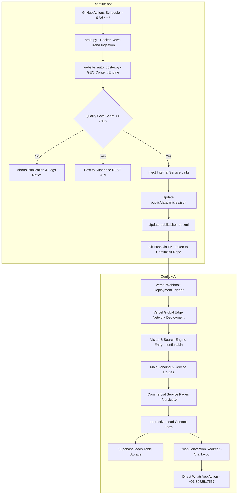

# 🏛️ Conflux AI — Complete System Architecture Blueprint

**Platform:** `https://confluxai.in`  
**Web Repository:** [`Tarunjit45/Conflux-AI`](https://github.com/Tarunjit45/Conflux-AI)  
**Bot Repository:** [`Tarunjit45/conflux-bot`](https://github.com/Tarunjit45/conflux-bot)  
**Deployment Infrastructure:** Vercel Edge Network & GitHub Actions Cloud Runners

---

## 1. 📐 System Topology & High-Level Architecture

The Conflux AI platform consists of two main decoupled systems operating in harmony:
1. **The Web & Commercial Client Acquisition Engine** (`Conflux-AI`): A ultra-fast React 18 + Vite + TypeScript single-page application deployed globally via Vercel.
2. **The Autonomous Content & GEO Machine** (`conflux-bot`): A serverless Python 3.11 engine running 4x daily on GitHub Actions cloud runners.



---

## 2. 🗂️ Component & Routing Architecture

### Routing Tree (`App.tsx`):
- `/` ➔ `LandingPage.tsx` (Main Hero, Value Proposition, Solutions, Proof, Contact)
- `/services/:serviceId` ➔ `ServiceDetailPage.tsx` (Commercial Service Deep Dives: `ai-automation`, `chatbot-development`, `website-development`, `seo-geo`, `digital-marketing`)
- `/thank-you` ➔ `ThankYouPage.tsx` (Post-Conversion Lead Confirmation & Direct WhatsApp Action)
- `/blog` ➔ `BlogPage.tsx` (Main Technical Research Feed)
- `/blog/:slug` ➔ `ArticleDetail.tsx` (Zero-Dependency Markdown Article Viewer with Like Button & Comments)
- `/about` ➔ `AboutUsPage.tsx` (Founders, Vision, Core Values)
- `/solutions` ➔ `SolutionsPage.tsx` (Commercial Solutions Catalog)
- `/creative` ➔ `CreativePage.tsx` (Design & Media Capabilities)
- `/impact` ➔ `ImpactPage.tsx` (Client Outcomes & Transformation Metrics)
- `/portfolio` ➔ `PortfolioPage.tsx` (Featured Technical Projects)
- `/authority` ➔ `AuthorityPage.tsx` (Research Network & Publications)
- `/faq` ➔ `FaqPage.tsx` (Interactive Enterprise Q&A)
- `/semantic-map` ➔ `SemanticPage.tsx` (Topic Architecture & Knowledge Graph Visualizer)

---

## 3. 🧠 Entity Knowledge Layer (`data/company.json`)

To prevent inconsistent company metadata across components and search engine schemas, `data/company.json` serves as the **Single Source of Truth**:

```json
{
  "name": "Conflux AI",
  "legalName": "Conflux AI",
  "website": "https://confluxai.in",
  "logo": "https://confluxai.in/logo.png",
  "description": "Conflux AI is a Local Visibility + Trust Platform that helps local businesses become discoverable, trusted, and contactable across Google and AI search.",
  "founders": [
    { "name": "Tarunjit Biswas", "role": "Founder & CTO", "email": "tarunjitbiswas24@gmail.com" },
    { "name": "Shouvik Majumdar", "role": "Co-Founder & Creative Director" }
  ],
  "contact": {
    "telephone": "+91-8972517557",
    "email": "tarunjitbiswas24@gmail.com",
    "address": { "city": "Kolkata", "state": "West Bengal", "country": "India" }
  },
  "socialProfiles": [
    "https://www.instagram.com/conflux.ai",
    "https://www.linkedin.com/company/conflux-ai",
    "https://www.youtube.com/@Confluxai-z9o",
    "https://x.com/ConfluxA12947"
  ]
}
```

---

## 4. 🤖 SEO & GEO Machine Readability Architecture

Conflux AI is engineered specifically for machine understanding by Google Search crawlers (`Googlebot`) and AI answer engines (`Google-Extended`, `GPTBot`, `PerplexityBot`, `ClaudeBot`).

### Schema.org `@graph` Hierarchy:
1. **`Organization`**: Declares company entity, founders, contact points, social profiles, and `knowsAbout` topics.
2. **`WebSite`**: Declares primary site entity, publisher link, and `SearchAction` target.
3. **`Service`**: Injected on `/services/:serviceId` to define commercial service type and deliverables.
4. **`FAQPage`**: Injected on service pages to allow AI models to directly extract Q&A blocks.
5. **`BreadcrumbList`**: Injected on service and blog pages for hierarchical breadcrumb navigation.
6. **`TechArticle`**: Injected on article pages to declare technical reading time, author, and date published.

---

## 5. ⚡ Autonomous Cloud Automation Architecture (`conflux-bot`)

```
[ 00:00, 06:00, 12:00, 18:00 UTC Cloud Trigger ]
                        │
                        ▼
           [ Hacker News API Trend Fetch ]
                        │
                        ▼
            [ Quality Score Evaluation ]
             - Title length > 15 chars (+2)
             - Word count > 150 words (+3)
             - Executive Summary present (+2)
             - FAQ section present (+2)
             - Valid primary source URL (+1)
                        │
                        ▼
       Score >= 7/10 ➔ Injects Internal Links
       - /services/ai-automation
       - /services/seo-geo
       - /services/chatbot-development
                        │
                        ▼
         Updates public/data/articles.json
         Updates public/sitemap.xml
                        │
                        ▼
       Git Push (PAT Token) to Conflux-AI Repo
                        │
                        ▼
      Vercel Webhook Deployment Live in ~30s
```

---

## 6. 🔒 Security & Data Integrity Safeguards

- **Strict Environment Encapsulation:** Zero private credentials committed to Git. `WEBSITE_PUSH_PAT` encrypted via PyNaCl / libsodium.
- **Fail-Safe Data Hydration:** Dual-layer fallback strategy (`Supabase REST API` ➔ `public/data/articles.json`) guaranteeing 100% website uptime.
- **XSS & Content Protection:** User-generated comments rendered purely as plain text strings without dangerous `dangerouslySetInnerHTML`.
